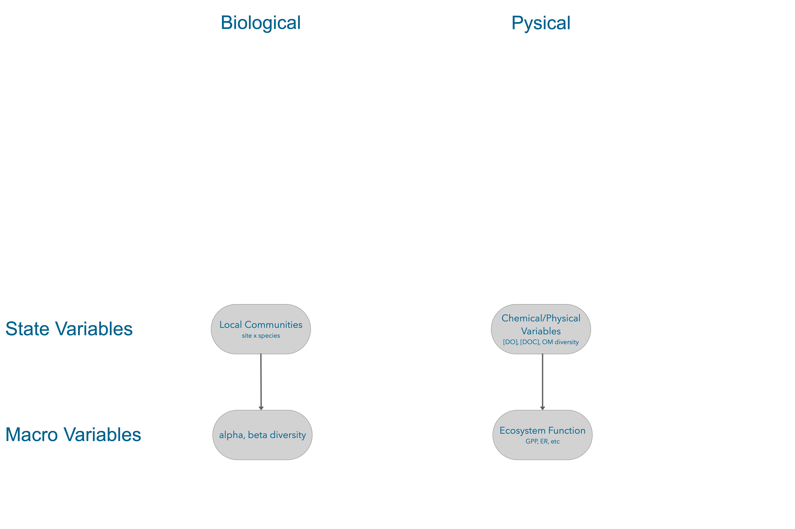
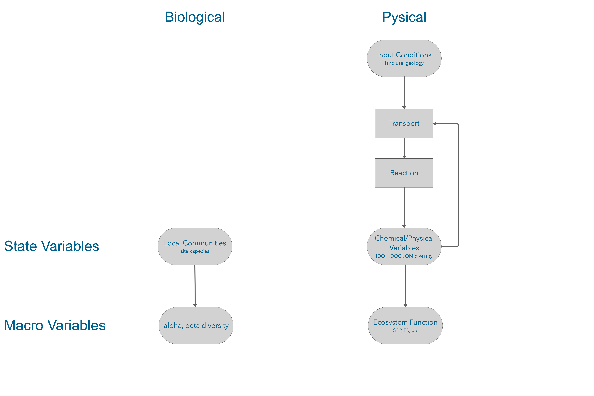
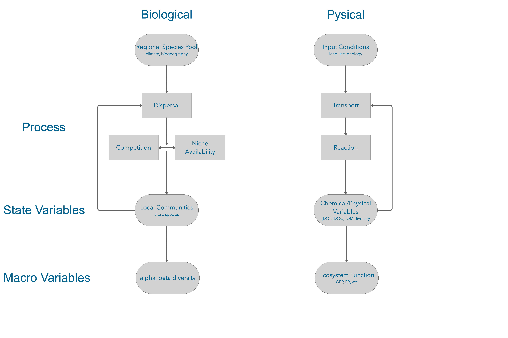
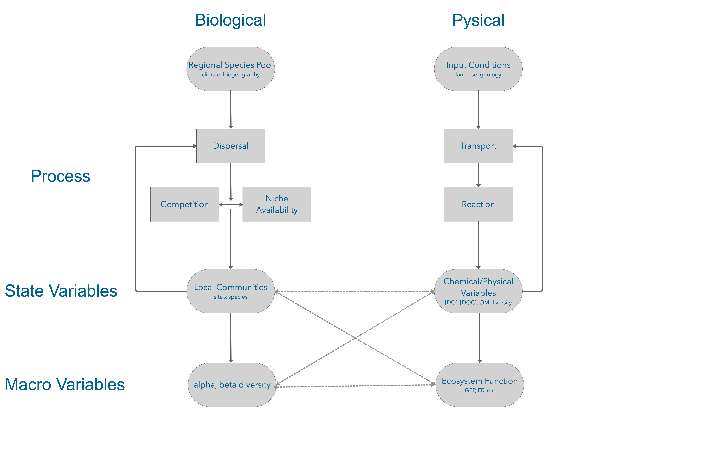
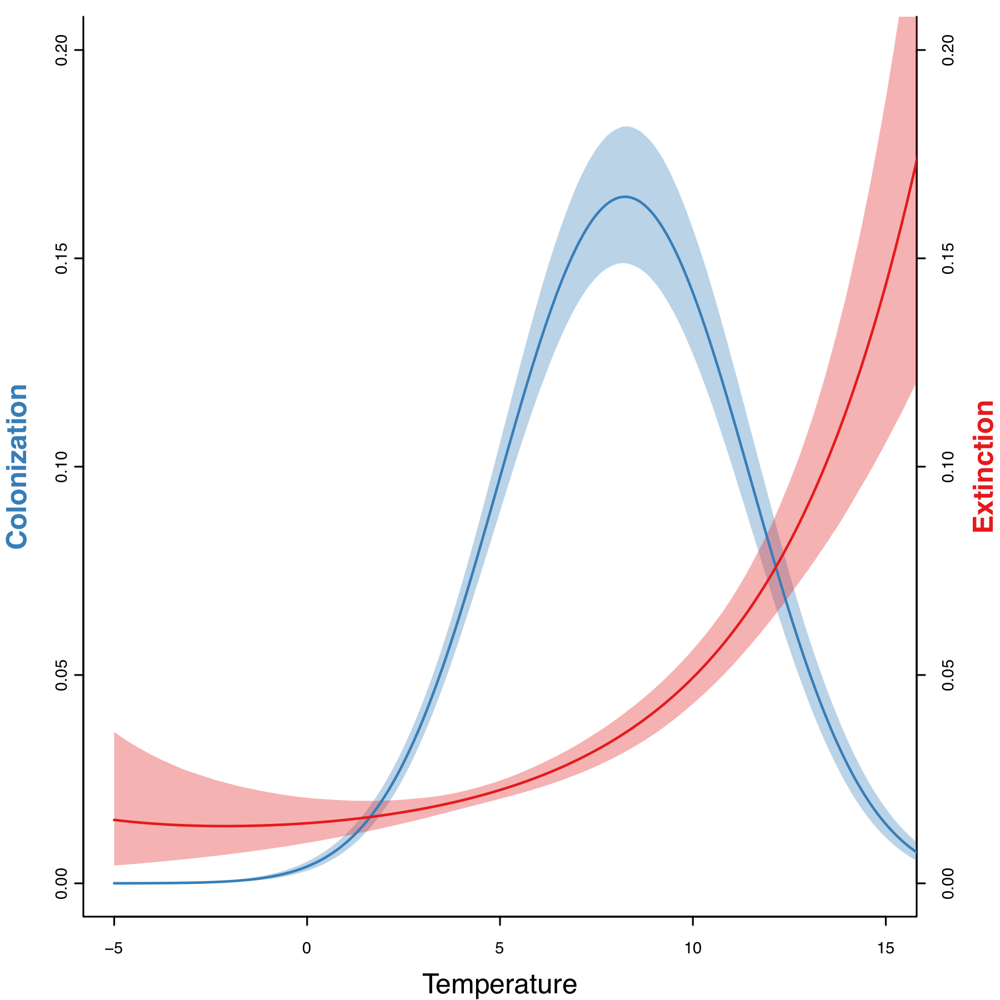
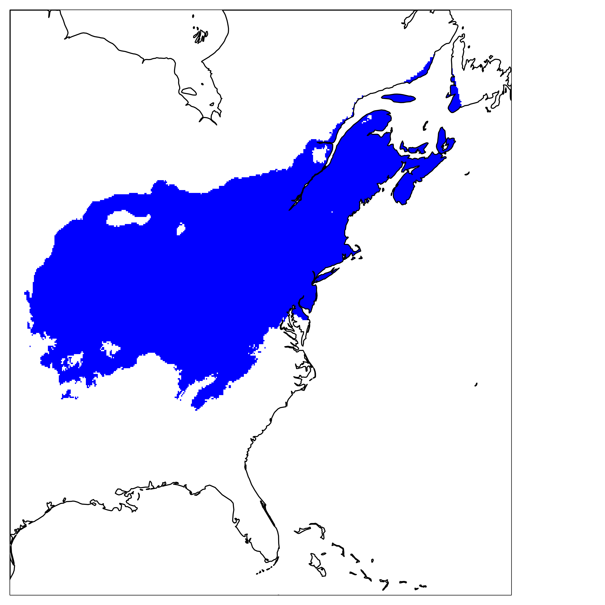

```{r setup, include=FALSE}
knitr::opts_chunk$set(echo = FALSE)
knitr::opts_chunk$set(fig.width=5.5, fig.height=5.5, collapse = TRUE, comment = "##")

# library(flume)
devtools::load_all("~/work/packages/flume")
library(igraph)
```


## Motivation

<center>
{width=80%}
</center>

## Motivation

<center>
{width=80%}
</center>

## Motivation

<center>
{width=80%}
</center>

## Motivation

<center>
{width=80%}
</center>

## Motivation

<center>
{width=80%}
</center>


## Objectives

Across an entire river network:

* Describe change of resource (POM, DOM, N, P, DO, etc.) concentrations in time (reaction-transport model)
* Describe change of community composition in time (metacommunity model)
* Link these two models via **resource processing** and **habitat filtering**
* Use the resulting model to ask questions in hypothetical river networks:
   - What processes dominate community organisation?
   - How will changes in land use/network structure affect communities/resources?
   - How is diversity related to functioning at local and network scales?
   - etc, etc...


## Metacommunity model

<div class='left' style='float:left;width:48%'>

* We are interested in the rate of change in the number of patches/reaches occupied by a focal species $i$. 
* Unoccupied patches ($h-p$) can be colonised, occupied ones can go extinct.

$$\frac{\partial p}{\partial t} = cp(h-p) - mp$$
</div>

<div class='right' style='float:left;width:48%'>

```{r fig.height = 7, fig.width = 7}
Q = c(13,12,8,7,1,4,1,1,2,1)
nsites = length(Q)
adj = matrix(0, nrow=nsites, ncol=nsites)
adj[2,1] = adj[3,2] = adj[9,2] = adj[4,3] = adj[5,4] = adj[6,4] = adj[7,6] = adj[8,6] = adj[10,9] = 1

network = river_network(adjacency = adj, discharge = Q)
layout = matrix(c(0,0,0,1,-0.5,2,-0.5,3,-1,4,0,4,-0.5,5,0.5,5,0.5,2,1,3), byrow=TRUE, nrow=nsites)
site_by_species(network) = matrix(c(0,1,1,0,0,1,1,0,1,1), ncol=1)
plot(network, layout = layout, edge.arrow.size = 0.2, variable='site_by_species')
```
</div>


## Metacommunity model

<div class='left' style='float:left;width:48%'>

* We are interested in the rate of change in the number of patches/reaches occupied by a focal species $i$. 
* Unoccupied patches ($h-p$) can be colonised, occupied ones can go extinct.
* Colonisation is influenced by dispersal, either passive ($\beta$, downstream only)

$$\frac{\partial p}{\partial t} = cp(\alpha + \color{red}{\beta Q})(h-p) - mp$$
</div>
<div class='right' style='float:left;width:48%'>
```{r fig.height = 7, fig.width = 7}
plot(network, layout = layout, edge.arrow.size = 0.2, variable='site_by_species')
arrows(0, 0.45, -0.35, 0.15, length=0.1)
text(-0.15, 0.2, expression(beta * Q), cex=0.8)
```
</div>


## Metacommunity model

<div class='left' style='float:left;width:48%'>

* We are interested in the rate of change in the number of patches/reaches occupied by a focal species $i$. 
* Unoccupied patches ($h-p$) can be colonised, occupied ones can go extinct.
* Colonisation is influenced by dispersal, either passive ($\beta$, downstream only) or active ($\alpha$, up/downstream)

$$\frac{\partial p}{\partial t} = cp(\color{red} \alpha + \beta Q)(h-p) - mp$$
</div>
<div class='right' style='float:left;width:48%'>
```{r fig.height = 7, fig.width = 7}
plot(network, layout = layout, edge.arrow.size = 0.2, variable='site_by_species')
arrows(0, 0.45, -0.35, 0.15, length=0.1)
text(-0.15, 0.2, expression(alpha + beta * Q), cex=0.8)

arrows(-0.35, -0.15, -0.35, 0.07,  length=0.1)
text(-0.25, -0.1, expression(alpha), cex=0.8)

```
</div>


## Metacommunity model

<div class='left' style='float:left;width:48%'>

* We are interested in the rate of change in the number of patches/reaches occupied by a focal species $i$. 
* Unoccupied patches ($h-p$) can be colonised, occupied ones can go extinct.
* Colonisation is influenced by dispersal, either passive ($\beta$, downstream only) or active ($\alpha$, up/downstream)
* Local colonisation is also influenced by patch quality ($q$) and resource concentration ($R$)

$$\frac{\partial p}{\partial t} = \color{red}{f(q,R)}p(\alpha + \beta Q)(h-p) - mp$$
</div>
<div class='right' style='float:left;width:48%'>
```{r fig.height = 7, fig.width = 7}
plot(network, layout = layout, edge.arrow.size = 0.2, variable='site_by_species')
arrows(0, 0.45, -0.35, 0.15, length=0.1)
text(-0.15, 0.2, expression(alpha + beta * Q), cex=0.8)

arrows(-0.35, -0.15, -0.35, 0.07,  length=0.1)
text(-0.25, -0.1, expression(alpha), cex=0.8)

text(-0.7, 0.17, "q, R", cex=0.8)
```
</div>


## Metacommunity model

<div class='left' style='float:left;width:48%'>

* We are interested in the rate of change in the number of patches/reaches occupied by a focal species $i$. 
* Unoccupied patches ($h-p$) can be colonised, occupied ones can go extinct.
* Extinction is determined locally as the combination of intrinsic extinction rate and the effects of species interactions

$$	\frac{\partial p}{\partial t} = c p(\alpha + \beta Q) \left( h-p \right) - p \color{red}{\left( \sum_{j \in S \setminus \left\{i \right\} }{m_{j}p_j} + m \right)} $$
</div>
<div class='right' style='float:left;width:48%'>
```{r fig.height = 7, fig.width = 7}
plot(network, layout = layout, edge.arrow.size = 0.2, variable='site_by_species')
arrows(0, 0.45, -0.35, 0.15, length=0.1)
text(-0.15, 0.2, expression(alpha + beta * Q), cex=0.8)

arrows(-0.35, -0.15, -0.35, 0.07,  length=0.1)
text(-0.25, -0.1, expression(alpha), cex=0.8)

text(-0.7, 0.17, "q, R", cex=0.8)
```
</div>


## OLD

**START HERE**
**simplify, streamline, harmonize terminology, add picture/diagram**
**use igraph and flume examples already to draw a network of sites**

$$ \frac{\partial p}{\partial t} = cp \left( h-p \right) - pm$$

This model is non-spatial, assumes infinite dispersal, and all patches are identical in quality.

- $p$: number of occupied patches
- $c$: colonisation rate
- $h$: number of available patches
- $m$: extinction rate


## A simple (single-species) metapopulation model

$$ \frac{\partial p}{\partial t} = cp \left( h-p \right) - pm$$

This model is non-spatial, assumes infinite dispersal, and all patches are identical in quality.

- $cp$: colonisation depends on prevalence; more occupancy means more propagules, faster colonisation
- $h-p$: only unoccupied patches can be colonised
- $pm$: only occupied patches can experience extinction


## Extending to metacommunities

- For species $i$ competing with a second species $j$

$$ \frac{\partial p_i}{\partial t} = c_i p_i \left( h-p_i \right) - p_i \left( m_{ij}p_j + m_i \right)$$

- Colonisation hasn't changed and is unaffected by competition
- The extinction rate $m$ now has two components

<p class="bullet2">Competitive exclusion in patches where they co-occur: $m_{ij}p_j$</p>
<p class="bullet2">Stochastic extinctions that add to extinction everywhere $i$ occurs: $m_i$</p>


<p class="reference">Hunt, Julia J. F. G., and Michael B. Bonsall. The Effects of Colonization, Extinction and Competition on Co-Existence in Metacommunities. Journal of Animal Ecology, vol. 78, no. 4, 2009, pp. 866–879</p>

## Extending to metacommunities

For $S$ species in a metacommunity <br/>
(and where $S \setminus \left\{i \right\}$ is the set of species excluding $i$):

$$ \frac{\partial p_i}{\partial t} = c_i p_i \left( h-p_i \right) - p_i \left( \sum_{j \in S \setminus \left\{i \right\} }{m_{ij}p_j} + m_i \right)$$


## Incorporating patch quality

- Goal: include patch quality in a way that allows for feedbacks with reaction-transport model


## Incorporating patch quality

- Goal: include patch quality in a way that allows for feedbacks with reaction-transport model
- For a patch $x$ with habitat quality $q$:

\begin{align}
	\frac{\partial p_{ix}}{\partial t} &= c_{ix} p_{ix} \left( h-p_{ix} \right) - p_{ix} \left( \sum_{j \in S \setminus \left\{i \right\} }{m_{ijx}p_{jx}} + m_{ix} \right) \\
	c_{ix} &= f(q_{ix}) \\
	m_{ix} &= g(q_{ix})
\end{align}

- This model is now spatially explicit and incorporates different niches for each species
- Note that in pratice, it doesn't make sense to talk about a rate for a specific patch, so we convert to probabilities of colonisation/extinction

<p class="reference">Talluto et al. 2017. Nature Ecol. Evol.</p>

## Incorporating patch quality

\begin{align}
	c_{ix} &= f(q_{ix}) \\
	m_{ix} &= g(q_{ix})
\end{align}

- $c$ and $m$ functions are flexible

For example, we used them to link C-E dynamics to climate:

{ width=30% } { width=30% }

<p class="reference">Talluto et al. 2017. Nature Ecol. Evol.</p>


## Adding Feedbacks

<center>
{width=80%}
</center>


## Adding Feedbacks

- Starting with a reaction transport model with state variable $R$ (a resource)
- Include a **resource use function**, $\rho_i(R)$, which is the effect of species $i$ on the resource

\begin{align}
	\frac{\partial R}{\partial t} &= \sum_{i \in S}{\rho_i(R)} -\frac{QR - Q_u R_u}{A dx}
\end{align}


## Adding Feedbacks

- Starting with a reaction transport model with state variable $R$ (a resource)
- Include a **resource use function**, $\rho_i(R)$, which is the effect of species $i$ on the resource


\begin{align}
	\frac{\partial R}{\partial t} &= \sum_{i \in S}{\rho_i(R)} -\frac{QR - Q_u R_u}{A dx} \\
	\frac{\partial p_{ix}}{\partial t} &= c_{ix} p_{ix} \left( h-p_{ix} \right) - p_{ix} \left( \sum_{j \in S \setminus \left\{i \right\} }{m_{ijx}p_{jx}} + m_{ix} \right) \\
	c_{ix} &= f(q_{ix}) \\
	m_{ix} &= g(q_{ix}) \\
	q_{ix} &= F_i(R_x)
\end{align}


## Adding Feedbacks

- Starting with a reaction transport model with state variable $R$ (a resource)
- Include a **resource use function**, $\rho_i(R)$, which is the effect of species $i$ on the resource


\begin{align}
	\frac{\partial R}{\partial t} &= \sum_{i \in S}{\rho_i(R)} -\frac{QR - Q_u R_u}{A dx} \\
	\frac{\partial p_{ix}}{\partial t} &= c_{ix} p_{ix} \left( h-p_{ix} \right) - p_{ix} \left( \sum_{j \in S \setminus \left\{i \right\} }{m_{ijx}p_{jx}} + m_{ix} \right) \\
	c_{ix} &= f(q_{ix}) \\
	m_{ix} &= g(q_{ix}) \\
	q_{ix} &= F_i(R_x)
\end{align}

-Two questions remain:

<p class="bullet2">How to define the strength of competition $m_{ix}$?</p>
<p class="bullet2">How to connect patch quality $q$ with resources $R$?</p>


## Patch Quality

Imagine that $R$ represents, instead of a point value, a *distribution* of resources in a patch

```{r fig.align = "center"}
suppressWarnings(library(ggplot2))
suppressWarnings(library(data.table))
suppressWarnings(library(RColorBrewer))

xl <- -9
xu <- 9

x <- seq(xl, xu, length.out=1000)

# set up colors
lpal <- c(brewer.pal(6, "Blues")[4:6], "#cb181d", "#6A2444", "#4d004b")
fpal <- paste0(lpal, "77")
fpal2 <- paste0(lpal, c(rep('22', 4), '77', '77'))
names(lpal) <- names(fpal) <- names(fpal2) <- c(paste0("s", 1:3), 'r', 's2_r', 's1_r')


fs1 <- function(x) dnorm(x, -2, 2)
fs2 <- function(x) dnorm(x, 0, 2)
fs3 <- function(x) dnorm(x, 2, 2)
fr <- function(x) dnorm(x, 2, 2)

## point where sp2 and resources cross
xpt_r_sp2 <- uniroot(function(x) fs2(x) - fr(x), c(xl, xu))$root

dat <- data.table(x = x)
dat[,c("s1", "s2", "s3", "r") := .(fs1(x), fs2(x), fs3(x), fr(x))]

pl0 <- ggplot(dat) + theme_minimal() + 
	scale_y_continuous(name="Density/Fitness", limits = c(0, max(dat$s1,dat$s2, dat$s3))) + 
	scale_x_continuous(name="Resource Value", limits = c(xl, xu)) + 
	theme(axis.text.x=element_blank(), axis.ticks.x=element_blank(), 
		axis.text.y=element_blank(), axis.ticks.y=element_blank())

pl_r <- pl0 + geom_polygon(aes(x=x, y=r), color=lpal["r"], fill=fpal["r"]) 
pl_r

```


## Patch Quality

Similarly, a species' niche can be characterized by a gaussian fitness function $\omega_i(R)$, showing how well it does under certain resource regimes

```{r fig.align = "center"}

pl_sp2 <- pl0 + geom_polygon(aes(x=x, y=s2), color=lpal["s2"], fill=fpal["s2"]) 
pl_sp2
```


## Patch Quality

Patch quality $q_{ix}$ then is the overlap between the resource distribution $R_x$ and the fitness function $\omega_i(R)$


```{r fig.align = "center"}
## note, this is easy to compute. If both are probability distributions with PDF f(x) and g(x) and CDFs F(x) and G(x), and they cross at x = c
## then the overlap area is just 1 - F(c) + G(c), assuming F(x) is the left curve

pl_s2_r <- pl_r + geom_polygon(aes(x=x, y=s2), color=lpal["s2"], fill=fpal["s2"])
pl_s2_r
```


## Patch Quality

Patch quality $q_{ix}$ then is the overlap between the resource distribution $R_x$ and the fitness function $\omega_i(R)$


```{r fig.align = "center"}
dat.overlap <- data.table(x = x)
dat.overlap[,y := fr(x)]
dat.overlap[x >= xpt_r_sp2, y := fs2(x)]
pl_s2_r_ol <- pl0 + geom_polygon(aes(x=x, y=r), color=lpal["r"], fill=fpal2["r"]) + geom_polygon(aes(x=x, y=s2), color=lpal["s2"], fill=fpal2["s2"]) + 
	geom_polygon(dat = dat.overlap, aes(x=x, y=y), color=lpal["s2_r"], fill=fpal["s2_r"]) 
pl_s2_r_ol
```


## Competition

- The strength of competition is similar

## Competition

- The strength of competition is similar
- For species $i$ and $j$ with fitness functions $\omega_i(R)$ and $\omega_j(R)$, the overlap between the functions is competition strength $m_{ij}$

```{r fig.align = "center"}

pl_sp1_sp2 <- pl0 + geom_polygon(aes(x=x, y=s1), color=lpal["s1"], fill=fpal["s1"]) + geom_polygon(aes(x=x, y=s2), color=lpal["s2"], fill=fpal["s2"]) 
pl_sp1_sp2
```


## Dispersal
<!-- note here; one possibility is to use quality q_ix as a proxy for how much the species uses -->
<!-- then change the mean of the resources by some amount, proportional to the overlap -->
<!-- thus species that are in good quality patches will have a bigger effect (they are more abundant) -->
<!-- \mu_new = \mu_old + q_ix * \alpha -->
<!-- where alpha is the maximal effect of the species on the resource -->
<!-- This might also be something to go to the literature on, or ask Ruben/Gabriel  -->

- The metapopulation model has the colonisation term $c_{ix}p_{ix}$
- The $p$ term represents dispersal
- To better represent dispersal in streams we can add active ($\alpha$) and passive ($\beta$) dispersal

$$ p_{ix}\left(\alpha_i + \sum{Q_y\beta_i}\right)$$


## To-do


### Revise \& finalise model
<p class="bullet2">How does a species affect resources in a patch? Need to choose the resource use function  $\rho_i(R)$</p>

### Decide on starting conditions
### Decide on scenarios and hypotheses