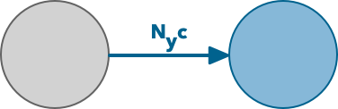

```{r setup, include=FALSE}
knitr::opts_chunk$set(echo = FALSE)
```
\newcommand{\vect}[1]{\mathrm{\mathbf{#1}}}

## A simple (single-species) metapopulation model

$$ \frac{\partial N}{\partial t} = Nc \left( H-N \right) - mN$$

This model is non-spatial, assumes infinite dispersal, and no (or identical) niches.

- $N$: number of occupied patches
- $c$: colonisation rate
- $H$: number of available patches
- $m$: extinction rate


## A simple (single-species) metapopulation model

$$ \frac{\partial N}{\partial t} = Nc \left( H-N \right) - mN$$

This model is non-spatial, assumes infinite dispersal, and no (or identical) niches.

- $Nc$: colonisation depends on prevalence; more occupancy means more propagules, faster colonisation
- $H-N$: only unoccupied patches can be colonised
- $mN$: only occupied patches can experience extinction


## Making the model spatial

$$ \frac{\partial N}{\partial t} = Nc \left( H-N \right) - mN $$

We define the state of patch $y$ at time $t$ by a state vector $\vect{X_{y,t}} \in \{ 0, 1 \}$.

It can take two states, occupied and unoccupied.

<center>
{ width=30% }
</center>


## Transition rates
$$ \frac{\partial N}{\partial t} = Nc \left( H-N \right) - mN $$

- Unoccupied patches become occupied at the rate $Nc$, 
- Occupied patches go extinct at rate $m$. 
- To make this rate local, use $N_y$, the number of patches neighbouring patch $y$ that are occupied.

<center style="margin-top:50px">
{width=80%}
</center>


## More realistic dispersal

<center style="margin-top:50px">
{width=30%}
</center>


- In a river, we can further incorporate and active and a passive component to dispersal by splitting apart the colonisation rate $c$:

$$
	c = \vect{Q_y} \alpha + \beta
$$

- $\vect{N_y}$: vector of presence-absence in all patches that are neighbours of patch $y$
- $\vect{Q_y}$: vector of discharge *into* the patch from neighbours (0 for downstream patches)
- $\alpha$: passive dispersal ability of the species
- $\beta$: active dispersal ability of the species.
- This gives a colonisation rate $= \vect{N_y} \left( \vect{Q_y} \alpha + \beta \right)$


##

<center style="margin-top:50px">
{width=80%}
</center>


## Adding niches

- So far the model is neutral; there is no difference in patch quality
- Species in nature can exploit resources with differing abilities

```{r fig.height = 4, fig.width = 4, fig.align = "center"}
col <- "#08306b77"
lcol <- "#08306b"
xl <- -7
xu <- 7
x <- seq(xl, xu, length.out=1000)
y <- dnorm(x, 0, 2)
xx <- c(x, rev(x))
yy <- c(y, rep(-1, length(x)))
par(bty='n', mar=c(2,2,0,0), mgp=c(1,0.1,0))
plot(0,0, xlim = c(xl, xu), ylim=range(y), type='n', xaxt='n', yaxt='n', xlab="Resource Value", ylab = "Fitness")
polygon(xx, yy, col=col, border=lcol)
```


## Adding niches

- Patches likewise can be expected to have a distribution of resources

```{r fig.height = 4, fig.width = 4, fig.align = "center"}
p_col <- "#cb181d77"
p_lcol <- "#cb181d"
p_y <- dnorm(x, 2, 2)
p_yy <- c(p_y, rep(-1, length(x)))
par(bty='n', mar=c(2,2,0,2), mgp=c(1,0.1,0))
plot(0,0, xlim = c(xl, xu), ylim=range(y), type='n', axes = FALSE, xlab="", ylab = "")
axis(side = 1, tick = FALSE, labels = FALSE)
mtext("Resource Value", side = 1, line = 1)
axis(side = 2, tick = FALSE, labels = FALSE)
mtext("Density", side = 2, line = 1, col=p_lcol)
polygon(xx, p_yy, col=p_col, border=p_lcol)
```


## Adding niches

- The area of overlap is the fitness of the species in the patch $\omega_y$

```{r fig.height = 4, fig.width = 4, fig.align = "center"}
## note, this is easy to compute. If both are probability distributions with PDF f(x) and g(x) and CDFs F(x) and G(x), and they cross at x = c
## then the overlap area is just 1 - F(c) + G(c), assuming F(x) is the left curve

par(bty='n', mar=c(2,2,0,2), mgp=c(1,0.1,0))
plot(0,0, xlim = c(xl, xu), ylim=range(y), type='n', axes = FALSE, xlab="", ylab = "")
axis(side = 1, tick = FALSE, labels = FALSE)
mtext("Resource Value", side = 1, line = 1)
axis(side = 2, tick = FALSE, labels = FALSE)
mtext("Density", side = 2, line = 1, col=p_lcol)
axis(side = 2, tick = FALSE, labels = FALSE)
mtext("Fitness", side = 4, line = 1, col=lcol)
polygon(xx, yy, col=col, border=lcol)
polygon(xx, p_yy, col=p_col, border=p_lcol)
```

- We add the patch quality term to the colonisation rate:

$$ c = \omega_y \left( \vect{Q_y} \alpha + \beta \right)$$


## Competition

- So far, we have a metapopulation model
- To make a metacommunity model, we consider multiple species, each with distinct niches


```{r fig.height = 4, fig.width = 4, fig.align = "center"}
library(RColorBrewer)
lcols <- brewer.pal(6, "Blues")[4:6]
cols <- paste0(lcols, '66')
centres <- c(-2, 0, 2)
y_s <- lapply(centres, function(m) dnorm(x, m, 2))
yy_s <- lapply(y_s, function(d) c(d, rep(-1, length(x))))
par(bty='n', mar=c(2,2,0,2), mgp=c(1,0.1,0))
plot(0,0, xlim = c(xl, xu), ylim=range(y), type='n', axes = FALSE, xlab="", ylab = "")
axis(side = 1, tick = FALSE, labels = FALSE)
mtext("Resource Value", side = 1, line = 1)
axis(side = 2, tick = FALSE, labels = FALSE)
mtext("Fitness", side = 2, line = 1, col=lcol)
dead <- mapply(function(ym, cfil, clin) polygon(xx, ym, col=cfil, border=clin), ym = yy_s, cfil = cols, clin = lcols)
```

- For a focal species, the overlapping area is the strength of competition with other species in the community.


## Competition

However, resources must also be present.

if $\omega_i$ is the overlap of the niche of species $i$ with the resources in a patch, and $\gamma_{i,j}$ is the overlap of the niches of both $i$ and $j$ with the resources of a patch, then $\frac{\gamma_{i,j}}{\omega_i}$ is a simple model for the strength of competition; the proportion of resources that are in competition with the two species.

Can extend this to all species, either by summing (in which case the sums of all overlaps could be much greater than 1), or by taking just the overlap with any species

